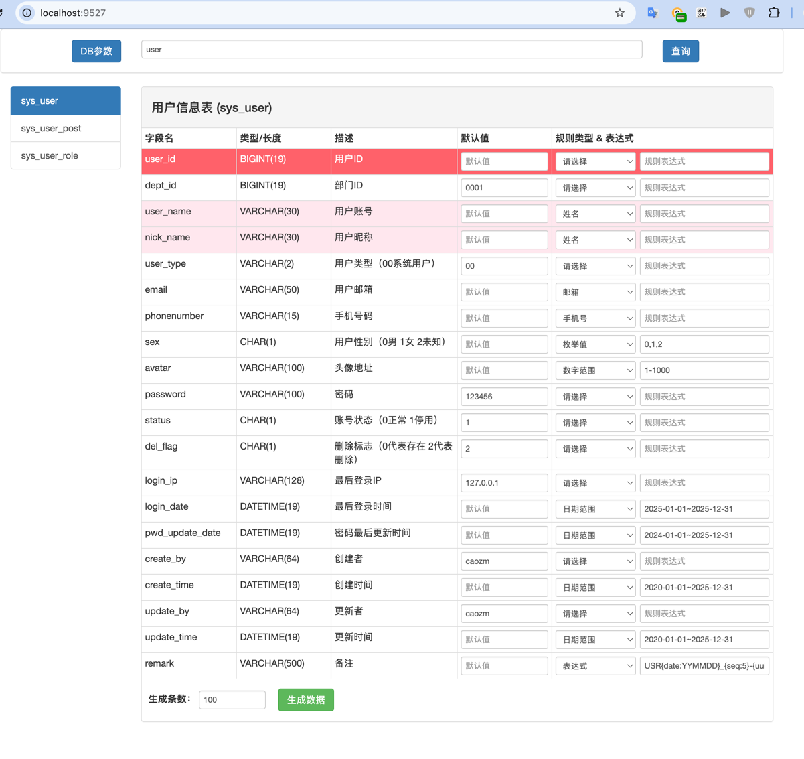
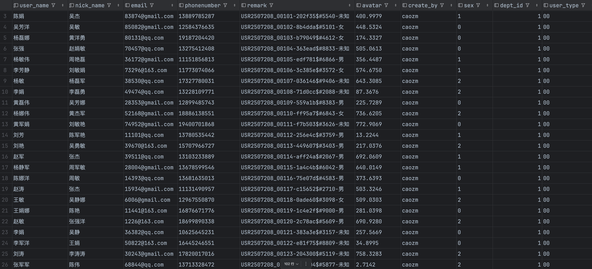

下面是一份结构完整、表达清晰、强调特点的 README.md，适用于你的数据造数项目，强调了 零依赖、规则灵活、即开即用 等卖点，适合吸引开发者/测试人员快速理解与使用：

⸻
# DBMocker - 一款灵活强大的造数工具

🚀 **DBMocker** 是一款专为开发、测试、数据验证等场景打造的轻量级数据造数工具，支持灵活配置、多种结构、无需依赖、开箱即用，助你一键生成各类模拟数据。

---

## ✨ 项目特点

- ✅ **自定义模板规则**：使用类似 `USR{date:YYMMDD}_{seq:5}-{uuid:6}$#{rand:1000-9999}-{enum:男,女,未知}` 的规则生成格式化 ID、手机号、时间、随机值等。
- ✅ **零依赖纯 Java 实现**：无需额外依赖库，部署轻便。
- ✅ **支持多种数据类型**：
    - 姓名、手机号、邮箱、UUID
    - 指定时间/时间范围
    - 指定数值/数值范围
    - 枚举字段、递增序列等
- ✅ **嵌入式 Web 页面**：通过 Web 界面配置规则，生成结果即时预览。
- ✅ **支持字段配置和结构预设**：适配多种数据库结构或测试场景。
- ✅ **Mock 工具化**：适合测试数据批量造数、接口联调、自动化测试前置数据生成。

---

## 🧱 示例规则说明

| 规则                 | 说明 |
|--------------------|------|
| `{date:yyMMdd}`    | 当前日期（例：240727） |
| `{seq:5}`          | 5 位递增序列（例：00001） |
| `{uuid:6}`         | 截取 UUID 前 6 位 |
| `{rand:1000-9999}` | 生成范围内的随机整数 |
| `{enum:男,女,未知}`    | 枚举随机选择值 |

📌 示例：

模板规则：
USR{date:yyMMdd}_{seq:5}-{uuid:6}$#{rand:1000-9999}-{enum:男,女,未知}

生成结果：
> USR2507208_00105-edf781$#6866-男
> USR240727_00001-8f3dce$#7231-女





---

## 🛠 使用方式

### 1. 克隆项目

```bash
git clone https://github.com/icaozm/DBMocker.git
cd DBMocker
```

2. 运行方式（支持以下任意方式）


    🔹  本地运行（需要 JDK 1.8 以上）


3. 访问页面
浏览器打开：
http://localhost:9527/


🧩 自定义扩展

你可以轻松实现自己的规则 handler：
``` java
public class CustomHandler implements PlaceholderHandler {
    @Override
    public String handle(String param, RuleContext ctx) {
        // 自定义逻辑
    }
}
```
然后注册到引擎中：
``` java
    engine.registerHandler("mytag", new CustomHandler());
```


🧳 TODO 规划

	•	模板保存功能

🙋‍♂️ 作者信息

	•	Author: [caozm]
	•	Email: iczming@163.com
	•	欢迎 PR / 提建议 / 一起共建！

---

如果你希望附带一些实际演示数据（如图、web界面截图、演示视频链接等）也可以在末尾加个 `## 🔍 示例演示` 模块。

需要我帮你自动生成 GitHub 仓库结构、示例模板文件或打包部署脚本也可以说一声。